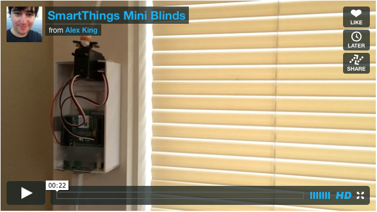
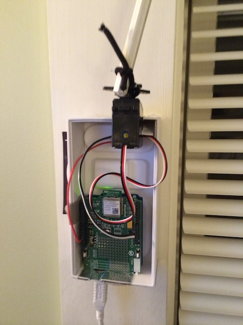
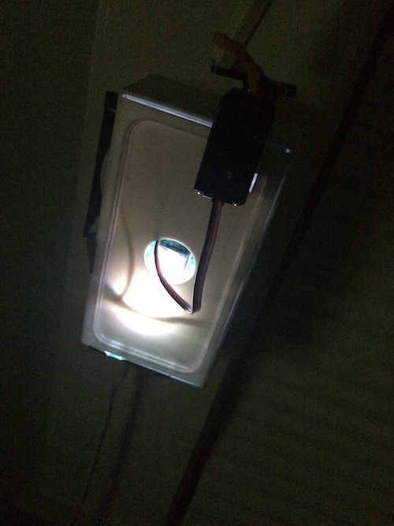

SmartThings Mini Blinds
=======================

I'm using this github repository just to document the SmartThings project I've been working on lately – controlling my window blinds via SmartThings - in case anyone else wants to build something similar, or apply any of it to another project.

I read this [article on Makezine](http://makezine.com/projects/mini-blind-minder/) while trying to find motorized blinds (because turning a handle is waaay too hard). I loved the simplicity of the mechanism, so I decided to build my own version that integrated with SmartThings (a fantastic smart home platform that allows you to connect a ton of various third party devices). 

[View the project in action on Vimeo](https://vimeo.com/81291367)

They offer a fantastic [SmartThings Arduino shield](https://shop.smartthings.com/#/products/smartthings-shield-arduino), which makes it incredibly easy to enable an arduino to connect via Zigbee. You'll also need an [Arduino Uno of some kind](https://www.sparkfun.com/products/11224). 

Since our version of the project will be controlled wirelessly, most of the parts needed for the original Makezine version aren't needed. You will need these items though -

- [Continuous Rotation Servo](http://www.parallax.com/product/900-00008)
- Rubber Band – although I've had more success using hair elastics with one rubber side)
- Project Case – I used an iPhone 5 box 

I also integrated the following parts I had laying around -

- [DHT11 Temperature and Humidity Sensor](https://www.adafruit.com/products/386) - I wouldn't recommend using this, it's not very accurate, but I figured it'd be fun to have an extra input
- [Photo resistor](http://bildr.org/2012/11/photoresistor-arduino/) - again, I'd [recommend something better if you can get it](http://bildr.org/2011/09/tsl230r-arduino/)

Note - you probably wouldn't do poorly by following the original project more closely than I have - many of my changes actually have more to do with the parts I had available at the time (my local RadioShack isn't very well stocked). In particular, in future versions I plan to add buttons to control the blinds. I didn't have any buttons.

### Arduino Code
The code to upload to the Arduino [is located here](arduino-code.ino) (there's some great [example code here](https://gist.github.com/aurman/6546221) that its based on). You'll need to install the following libraries -

- [SmartThings Arduino Library](http://build.smartthings.com/arduino/)
- [Adafruit DHT11](https://github.com/adafruit/DHT-sensor-library) (optional, only needed if you're using the DHT11 temperature/humidity sensor)
- [Servo Calibration from the Makezine project](http://grathio.com/assets/make/blind_minder_arduino.zip) - you'll want to calibrate the servo before doing anything else, or it will spin around with a mind of its own. That download also includes the original Arduino sketch - if you're following that build more closely, it may include handy information to talking to the components they use. 
 
### SmartThings Device Type Code
The code to use to create the device to [is located here](device-type.groovy) (based on this [SmartThings example code](https://gist.github.com/aurman/6862503)). The [SmartThings arduino page](http://build.smartthings.com/arduino/) has information on how to set up a device type in the IDE. 

### Building It
I'll assume that you can figure out how to hook up the individual components to the Arduino, and focus more on the specifics of my iPhone box build. Here's the basic setup –

As you can see, it's an iPhone 5S box attached to the wall (I recommend mounting [Command Strips](http://www.command.com/wps/portal/3M/en_US/NACommand/Command/) or something similar to avoid damaging the wall – of course if you don't live in an apartment and you can "damage" whatever you want, I'd recommend looking into [this sort of in-blinds build](https://homeawesomation.wordpress.com/2013/02/26/automated-window-blinds-with-arduino/)!). I've cut a hole in the top, and precariously screwed the servo into the box. The servo is then connected to the blinds with a rubber band (read [step 10 of the original article](http://makezine.com/projects/mini-blind-minder/) for details on this slip clutch setup). It seems like you do want the servo to have a little play up and down, or it will run into the blind rod. 

I cut another hole in the side for the photoresistor, and hot glued it in place. I added a SparkFun mini breadboard above the shields (which are mostly held there by a little tape and the USB power cable). The SmartThings Arduino shield happens to have a nice RGB led built in, so I covered the box with the plastic iPhone holder it came with, and it glows nicely at night. 

### What's Next?

I hope to continue improving the project by giving it a better case, and a better drive mechanism. So far no success with 3d printing parts in elasto plastic on Shapeways (not quite elastic enough), but I'll try to keep this repo updated as changes are made. 

### Thanks!

- To the [original Makezine article](http://makezine.com/projects/mini-blind-minder/) that inspired the design
- To the [SmartThings community](http://build.smartthings.com), example code, and documentation
- To the [Arduino.cc](http://arduino.cc) example code and documentation